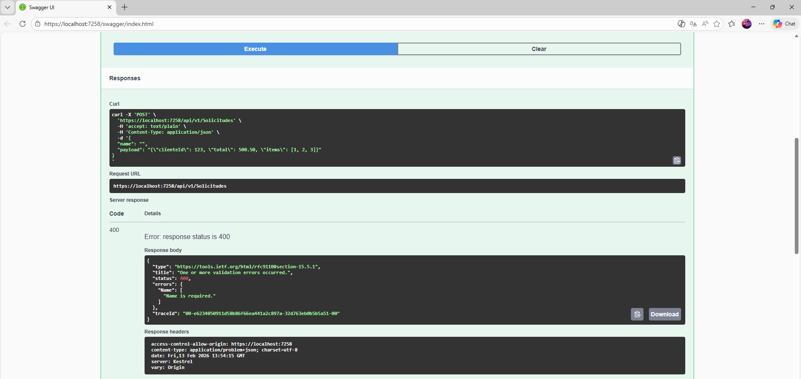
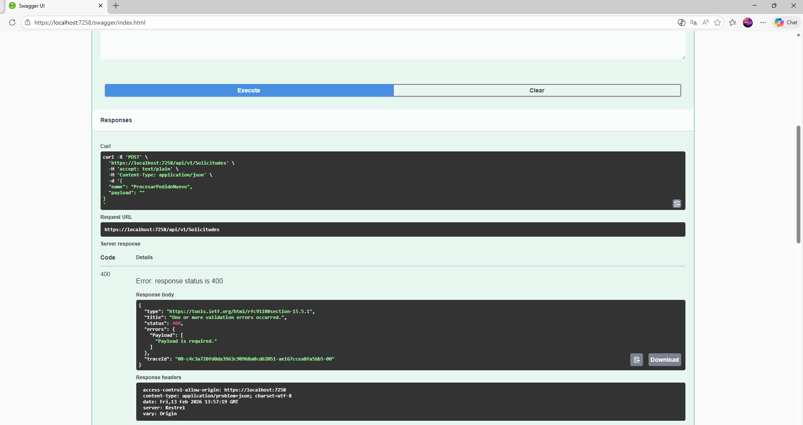
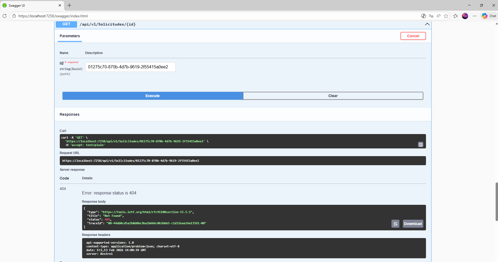
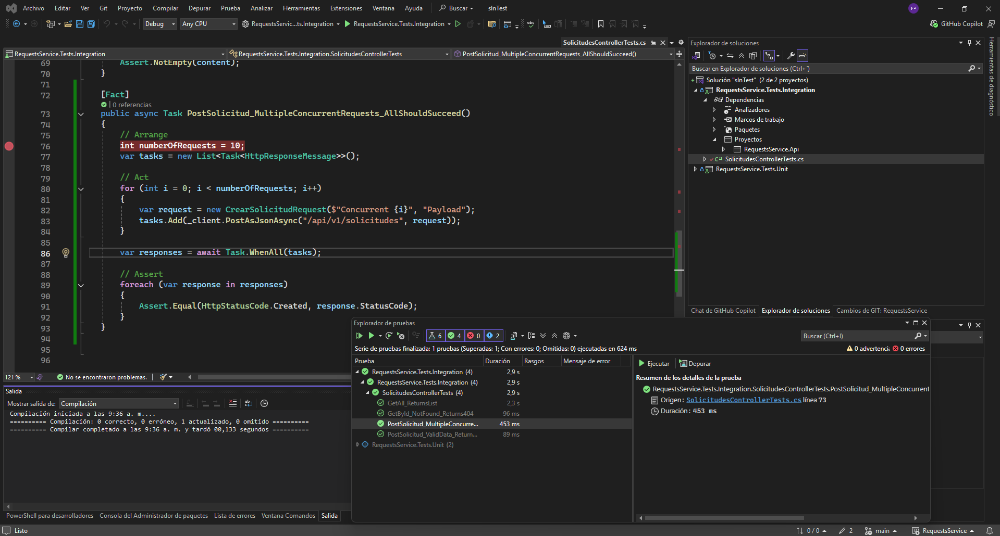
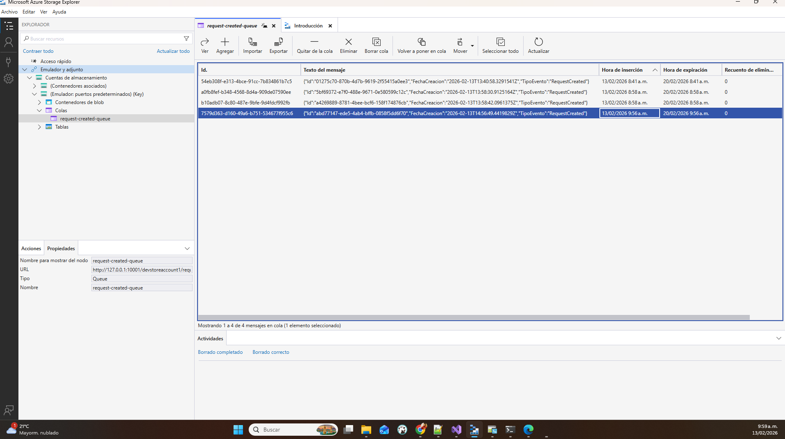

# RequestsService - Microservicio Empresarial (.NET 8)

Un servicio de gestión de solicitudes genérico, robusto y de grado empresarial, construido con **ASP.NET Core Web API**, siguiendo los principios de **Clean Architecture** y **SOLID**.

## 🚀 Características Principales
- **Arquitectura Empresarial**: API basada en Controllers diseñada para escalabilidad y complejidad.
- **Patrón CQRS**: Responsabilidades de Command y Query desacopladas utilizando **MediatR**.
- **API Versioning**: Soporte nativo para versionado (ej., `/api/v1/solicitudes`).
- **OpenAPI/Swagger**: Documentación completa de la API con soporte para versionado.
- **Validación**: Validación estricta de solicitudes utilizando **FluentValidation**.
- **Resiliencia**: Integración con **Azure Queue Storage** para mensajería de eventos confiable.
- **Pruebas**: Suite completa de **Unit Tests** e **Integration Tests** utilizando `xUnit`, `Moq` y `WebApplicationFactory`.

## 🏗️ Arquitectura
La solución sigue la regla de dependencia estricta de Clean Architecture:
`Domain` ← `Application` ← `Infrastructure` / `Api`

### Proyectos
- **RequestsService.Domain**: Entidades principales (`Solicitud`), enumeraciones e interfaces de repositorios.
- **RequestsService.Application**: Casos de uso implementados como Commands/Queries (CQRS), DTOs y Validadores.
- **RequestsService.Infrastructure**: Implementación de preocupaciones externas (Persistencia, Azure Queue).
- **RequestsService.Api**: Punto de entrada, Controllers, Middleware, configuración de DI.
- **RequestsService.Tests.Unit**: Pruebas unitarias para la lógica de Application.
- **RequestsService.Tests.Integration**: Pruebas de API de extremo a extremo (End-to-end).

## 🏃‍♂️ Primeros Pasos

### Prerrequisitos
- .NET 8 SDK
- Docker (para Azurite)
- Emulador de Azure Storage (Azurite) o Cuenta de Azure

### Configuración de Secretos Locales (User Secrets)
Tras clonar el repositorio, ejecute los siguientes comandos para configurar la cadena de conexión de desarrollo de forma segura:

1. **Inicializar User Secrets** (si no se ha hecho previamente):
   ```bash
   dotnet user-secrets init --project RequestsService.Api
   ```

2. **Configurar la cadena de conexión de Azurite**:
   ```bash
   dotnet user-secrets set "AzureQueueStorage:ConnectionString" "UseDevelopmentStorage=true" --project RequestsService.Api
   ```
   ```bash
   dotnet user-secrets set "AzureQueueStorage:ServiceVersion" "V2024_08_04" --project RequestsService.Api
   ```

> **Nota:** Los User Secrets se almacenan fuera del repositorio en su perfil de usuario (`%APPDATA%\Microsoft\UserSecrets\` en Windows). Nunca se suben al control de versiones.

### Ejecución Local
1. **Iniciar Azurite** (emulador de Azure Storage):
   ```bash
   docker-compose up -d
   ```

2. **Restaurar Dependencias**:
   ```bash
   dotnet restore
   ```

3. **Ejecutar la API**:
   ```bash
   dotnet run --project RequestsService.Api
   ```
   Acceda a la UI de Swagger en: `https://localhost:7258/swagger` (o puerto configurado).

### Configuración
La aplicación lee `AzureQueueStorage:ConnectionString` desde `IConfiguration`, que soporta las siguientes fuentes transparentemente:
- **Desarrollo local:** User Secrets (`dotnet user-secrets set ...`)
- **Producción:** Variables de entorno o Azure Key Vault

El nombre de la cola se configura en `appsettings.json`:
```json
"AzureQueueStorage": {
  "QueueName": "request-created-queue"
}
```

### 🐳 Docker Compose (Full Stack)
Para ejecutar la solución completa (**API + Azurite**) en contenedores, asegurando que la API sea accesible en los puertos estándar de desarrollo (`5290` HTTP / `7258` HTTPS):

1. **Confiar en el certificado de desarrollo** (Command Prompt / PowerShell):
   ```bash
   dotnet dev-certs https --trust
   ```

2. **Iniciar los servicios**:
   ```bash
   docker-compose up --build
   ```

| Servicio      | URL Interna Docker    | URL Local Host                |
|---------------|-----------------------|-------------------------------|
| **API**       | `http://api:5290`     | `http://localhost:5290`       |
|               | `https://api:7258`    | `https://localhost:7258`      |
| **Swagger**   |                       | `https://localhost:7258/swagger` |
| **Azurite**   | `http://azurite:10001`| `127.0.0.1:10001`             |


## 🧪 Ejecutando Pruebas
Ejecute la suite completa de pruebas (Unit + Integration):
```bash
dotnet test
```

## 📋 Escenarios de Prueba y Validación

A continuación se detallan los escenarios críticos de validación y manejo de errores implementados en el servicio:

| Escenario | Descripción del Manejo | Evidencia (Foto) |
| :--- | :--- | :--- |
| **Enviar información incompleta** | Se utiliza `FluentValidation` en la capa de Aplicación para asegurar que campos como `Name` y `Payload` no estén vacíos. Si fallan, se devuelve un `400 Bad Request` con los detalles. |   |
| **Consultar identificadores inexistentes** | El Query Handler verifica si la entidad existe en el repositorio. Si no se encuentra, devuelve un resultado fallido que se traduce en un `404 Not Found`. |  |
| **Realizar múltiples llamadas simultáneas** | El servicio utiliza el patrón asíncrono (`async/await`) de .NET 8 y `MediatR` para manejar múltiples solicitudes de forma concurrente y eficiente sin bloquear hilos. |  |
| **Azure Storage Explore** | Captura de Colas |  |

## 📋 Endpoints de la API (v1)
- **POST** `/api/v1/solicitudes` - Crear una nueva solicitud.
- **GET** `/api/v1/solicitudes/{id}` - Obtener una solicitud por ID.
- **GET** `/api/v1/solicitudes` - Obtener todas las solicitudes.


